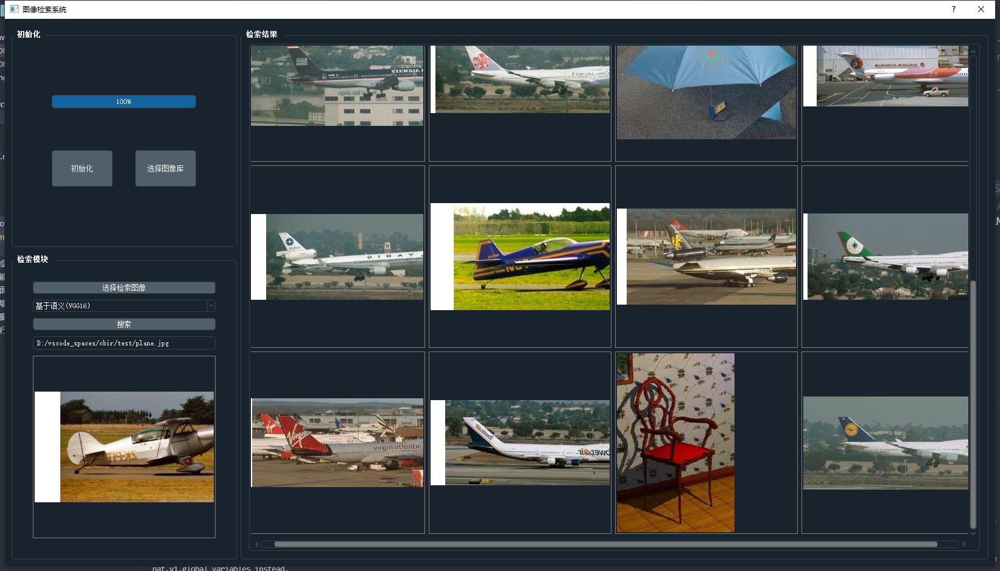

# 图像检索系统
## 功能说明
1. 初次使用时在初始化模块中选择图象库路径进行初始化
2. 初始化完成后，选择待检索图像，选择所要使用的算法
3. 点击检索图像以后，界面右侧显示出检索的图像
4. 点击图像会唤出资源管理器选中所对应的图像
5. 支持SIFT特征检索、VGG16特征检索、VGG19特征检索
## 界面截图

## 环境要求
+ Python3.6.5
+ PyQt5 5.13.0
+ Tensorflow 2.0.0
+ OpenCV-Python 4.5.5.64
## 数据集
[Caltech-101](https://tensorflow.google.cn/datasets/catalog/caltech101?hl=zh-cn)
本系统截取了部分作为图像，注意：将所有图片放在同一个data文件夹下
## 运行
```sh
python Mainwindow.py
```
## 已知的小bug
点击图片跳转到资源管理器的功能有问题，只能正确的跳转到最后一张图像，待完善...
# 联系我
+ vx: xxscoder
+ email: wu_lizhao@yeah.net
